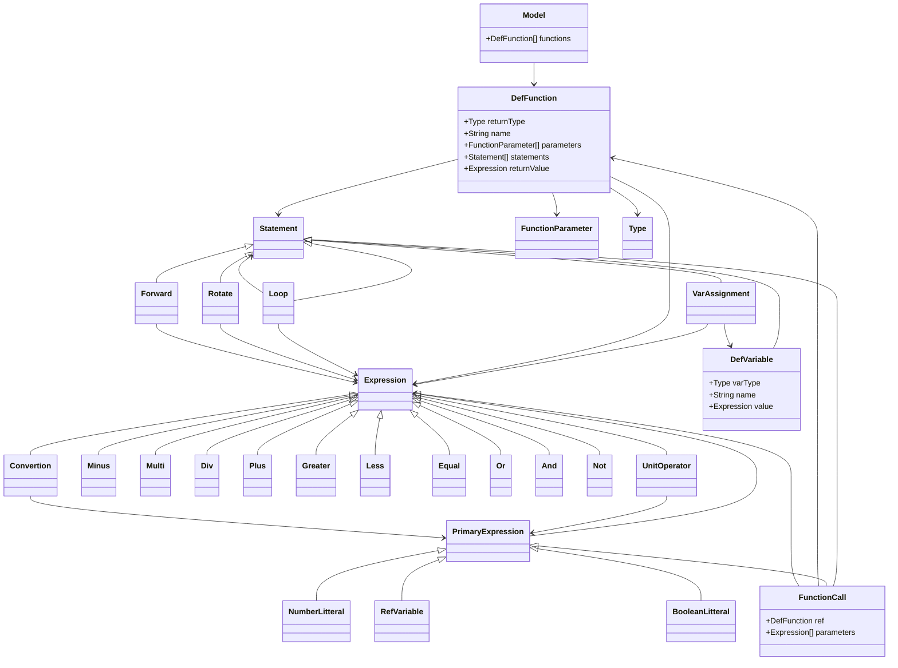
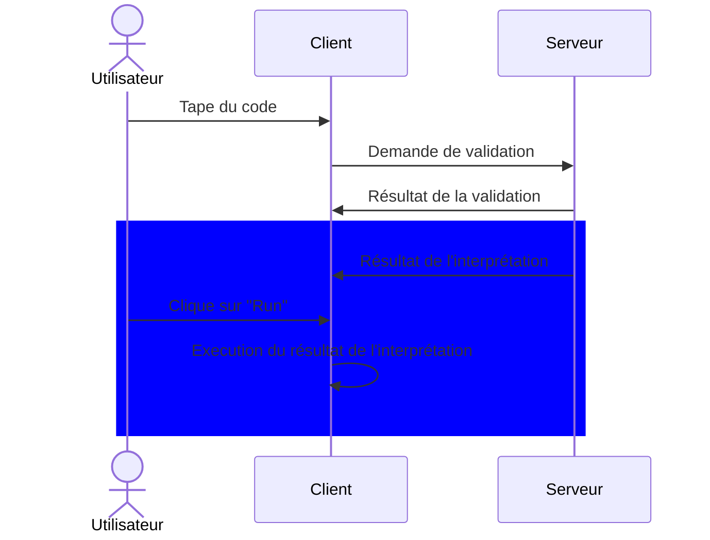

<h1 align="center">Projet ASE - Mini Mecha Code</h1>
<h4 align="center">Cody ADAM & Mael KERICHARD</h4>
<p align="center">
   
   
   
</p>


> On fait le choix d'être noter en priorisant la partie interprétation du code, puis la partie compilation.

## 🗂️ Structure du projet

```text
.
├── dsl - Contient le projet eclise
└── mini-mecha-code - Contient le projet langium
```

## 👷 Utilisation

### 🌐 Web

Le projet est [accessible ici](https://pixselve-school.github.io/ASE-DSL/static/monacoClassic).

Néanmoins, pour le compiler soi-même :

```bash
cd mini-mecha-code
npm i
npm run langium:generate
npm run build:web
```

Puis pour lancer le serveur web :

```bash
npm run serve
```

Et rendez-vous à l'adresse affichée dans la console.

### 🧩 Extension VSCode

```bash
cd mini-mecha-code
npm i
npm run langium:generate
npm run build
```
- Appuyez sur `F5` pour ouvrir une nouvelle fenêtre avec l'extension chargée.
- Créez un nouveau fichier avec comme extension `.mini`
- Enjoy !

### 💬 CLI

```bash
cd mini-mecha-code
npm i
npm run langium:generate
npm run build
```

Utilisez `node ./bin/cli` pour afficher les options disponibles ou `node ./bin/cli generate <file>` pour générer le code Adruino.

## 🖼️ Screenshots


## Choix technique

Tout d'abord, il faut savoir que notre grammaire définie avec notre projet Xtext est relativement éloignée de celle qu'on retrouve sur notre projet Langium.
On avait commencé par faire une grammaire avec Xtext, mais on a eu des problèmes pour la convertir en Langium, on a donc décidé de repartir presque de zéro.

Néanmoins, les principaux choix ont été pris lorsque de la conception de la grammaire Xtext.

### 📜 Grammaire

On a décidé de faire une grammaire relativement simple, qui couvre la plupart des besoins du projet que l'on a définis en utilisant les exemples fournis dans le sujet.

Voici un diagramme de la grammaire :



- Le programme est composé de plusieurs fonctions.
  - Il n'est pas possible de définir des variables globales.
  - Il n'est pas possible de définir des fonctions dans des fonctions.
- On peut utiliser des opérateurs arithmétiques (`+`, `-`, `*`, `/`), de comparaison (`>`, `<`, `==`) et des opérateurs logiques (`&&`, `||`, `!`).
  - On a décidé qu'en arrière-plan , toutes les valeurs seront des nombres flottants, et que les booléens seront représentés par `0` et `1`. Cela permet de simplifier l'implémentation.
- Il est possible d'utiliser des mots clés prédéfinis (`Clock`, `Forward`). Comme ces mots clés sont utilisés d'une manière différente qu'un appel classique de fonction, on a décidé de les traiter comme des opérateurs.
- On profite de Langium et de sa gestion des références pour faire en sorte que les fonctions et les variables soient définies avant d'être utilisées, et que les interfaces en arrière-plan contiennent une référence vers la définition de la fonction ou de la variable.
- On a décidé de ne pas utiliser de `;` pour séparer les instructions, mais plutôt de les séparer par des retours à la ligne. Cela permet de simplifier la grammaire et de ne pas avoir à gérer les cas où il y a plusieurs `;` à la suite.
- Les appels de fonctions sont classiques, on utilise `nomFonction(param1, param2, ...)`.
  - On a fait le choix de ne pas inclure les fonctions tel que `getSpeed()` ou `getTimestamp()` dans la grammaire, car on a décidé de les traiter comme des fonctions prédéfinies (présentes dans la STD).

### 📦 Architecture

#### 🗣️ Communication client-serveur

On a décidé d'utiliser le canal ouvert par défaut lorsque l'on utilise le langage server sur le client. Cela permet de communiquer via l'envoi de messages (via l'utilisation d'une connexion WebSocket).



On intercepte la communication entre le client et le serveur pour pouvoir afficher les erreurs de validation, et on interprète directement le code à la volée.

Le résultat de l'interprétation est ensuite traité par le client et affiché lorsque l'utilisateur clique sur le bouton "Run".


#### 📦 STD

Afin de profiter de la puissance de Langium, on a décidé de faire une STD (Standard Type Definition) qui contient les fonctions prédéfinies du langage.
Cela nous permet notamment de pouvoir utiliser les mêmes règles de validations que pour les fonctions définies par l'utilisateur.

Cette STD est injectée via le fichier `mini-mecha-code/src/language/mini-mecha-code-workspace-manager.ts`, en suivant la [documentation de Langium](https://langium.org/guides/builtin-library/).

Néanmoins, nous avons fait face à un problème lors d'utilisation de cette STD avec la CLI (aucune documentation éxiste). Nous avons donc fait le choix de désactiver la validation lorsque l'on utilise la CLI. Le code Adruino est néanmoins généré correctement.

#### 📦 Validation (`mini-mecha-code/src/language/mini-mecha-code-validator.ts`)

Voici les règles de validation que l'on a défini :

- Vérifier si une variable définie (`defVariable`) n'est pas déjà définie dans le même bloc de code ou en tant que paramètre de la fonction englobante.
- Vérifier si une fonction (`DefFunction`) n'est pas déjà définie dans le modèle global ou parmi les fonctions intégrées.
- Vérifier que le programme a une fonction d'entrée (`entry`).
- Vérifier que la fonction d'entrée n'utilise pas de paramètres.
- Vérifier si un appel de fonction (`FunctionCall`) utilise le bon nombre de paramètres par rapport à la définition de la fonction appelée.

#### 👷 Interprétation (`mini-mecha-code/src/interpretor/interpretor.ts`)

On a fait le choix de ne pas utiliser de pattern visitor pour l'interprétation, mais plutôt d'utiliser des fonctions récursives, ainsi que les fonctions `is<Type>` de Langium.
Cela simplifie grandement l'implémentation, et éviter les heures de débuggage et recherche que nos camarades ont eu à faire.

On remarquera aussi que notre méthode nécessite beaucoup moins de code qu'une méthode avec un pattern visitor. Notre méthode est donc plus facile à maintenir et à faire évoluer.

#### 📦 Compilation

Très similaire à l'interprétation, on a fait le choix de ne pas utiliser de pattern visitor pour la compilation, mais plutôt d'utiliser des fonctions récursives, ainsi que les fonctions `is<Type>` de Langium.

On a aussi fait le choix d'inclure une STD dans le code Adruino généré, afin de pouvoir utiliser les fonctions qui permettent de contrôler le robot (`mini-mecha-code/src/compiler/std-arduino.ts`).

Cela permet de séparer la partie compilation en elle même de la partie intégration avec le robot, qui permet de tester plus facilement cette STD dans un premier temps, et ensuite, de ne s'occuper que du lien entre le code généré et cette STD.