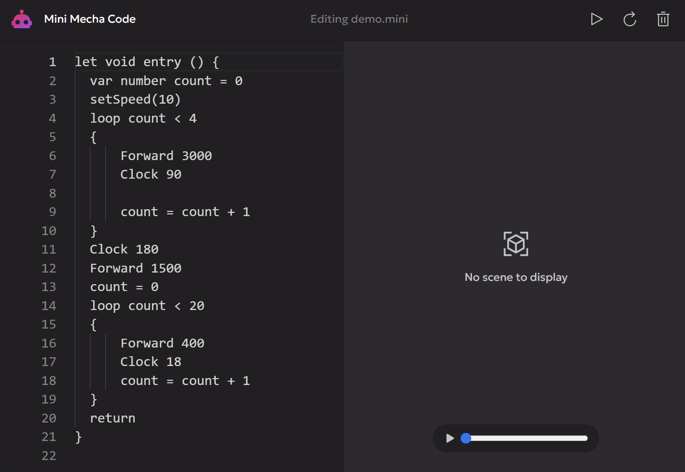

<h1 align="center">Projet ASE - Mini Mecha Code</h1>
<h4 align="center">Cody ADAM & Mael KERICHARD</h4>
<p align="center">
   
   
   
</p>

## 🗂️ Structure du projet

```text
.
├── dsl - Contient le projet eclise
└── mini-mecha-code - Contient le projet langium
```

## 👷 Utilisation

### 🌐 Web

Le projet est [accessible ici](https://pixselve-school.github.io/ASE-DSL/static/monacoClassic).

Néanmoins, pour le compiler soi-même :

```bash
cd mini-mecha-code
npm i
npm run langium:generate
npm run build:web
```

Puis pour lancer le serveur web :

```bash
npm run serve
```

Et rendez-vous à l'adresse affichée dans la console.

### 🧩 Extension VSCode

```bash
cd mini-mecha-code
npm i
npm run langium:generate
npm run build
```
- Appuyez sur `F5` pour ouvrir une nouvelle fenêtre avec l'extension chargée.
- Créez un nouveau fichier avec comme extension `.mini`
- Enjoy !

### 💬 CLI

```bash
cd mini-mecha-code
npm i
npm run langium:generate
npm run build
```

Utilisez `node ./bin/cli` pour afficher les options disponibles ou `node ./bin/cli generate <file>` pour générer le code Adruino.

## 🖼️ Screenshots


